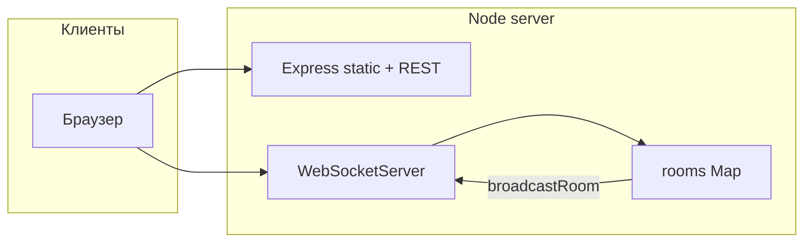

# Архитектура

## Поток данных

1. Клиент подключается по **WebSocket** к тому же хосту/порту, что и страница.
2. Сервер держит `rooms: Map<roomCode, room>`.
3. Каждая комната: `hostId`, `gameMode`, `players` (id → `{ ws, name, team, role }`), `settings`, объект `game`, таймеры (`timerTimeout`, `confirmTimeout` для Codenames).

## Рассылка состояния

- Функция **`broadcastRoom(room)`** перебирает игроков и шлёт каждому **`JSON.stringify(getPlayerState(room, playerId))`** с полем `type: 'state'`.
- Часть информации **зависит от игрока** (например, шпион в Spyfall не видит локацию до конца раунда; в монополии — своя рука и т.д.) — это реализовано внутри `get*State`.

## HTTP

- Раздача **`public/`** как статики.
- Префикс **`/api`** — JSON (список колод монополии для всех; **`/api/admin/*`** — только с заголовком админа).

## Режим обслуживания

Если `MAINTENANCE_MODE=1`, middleware отдаёт `maintenance.html` и блокирует апгрейд WebSocket для клиентов без bypass-cookie. См. [05-environment-variables.md](05-environment-variables.md).

## Масштабирование

Сейчас **один процесс = одна горизонталь**. Несколько инстансов за балансировщиком **не синхронизируют комнаты** между собой — для продакшена обычно один инстанс или sticky sessions на уровне WS (не реализовано в коде).
